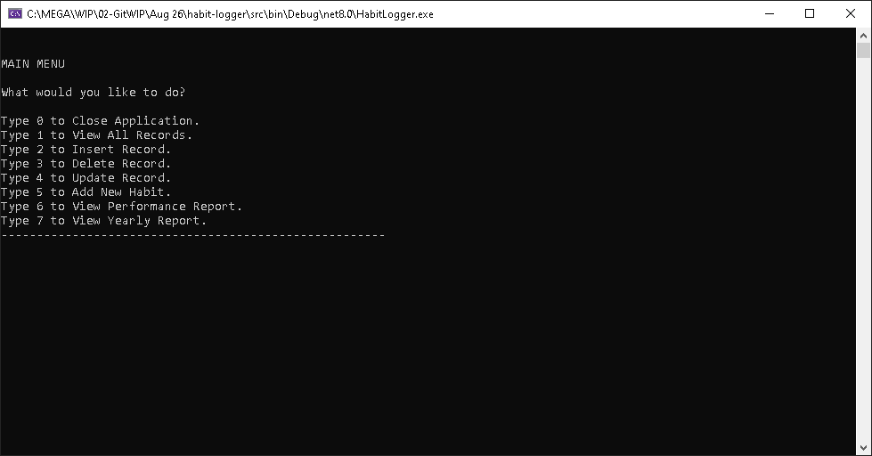
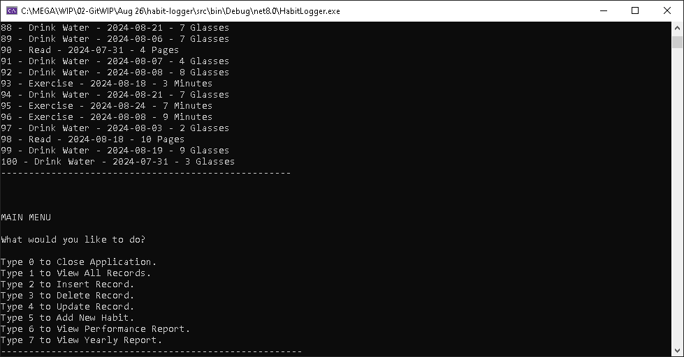
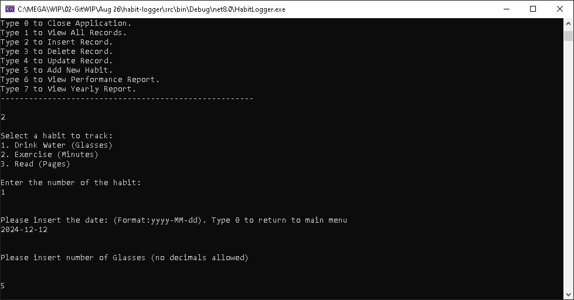
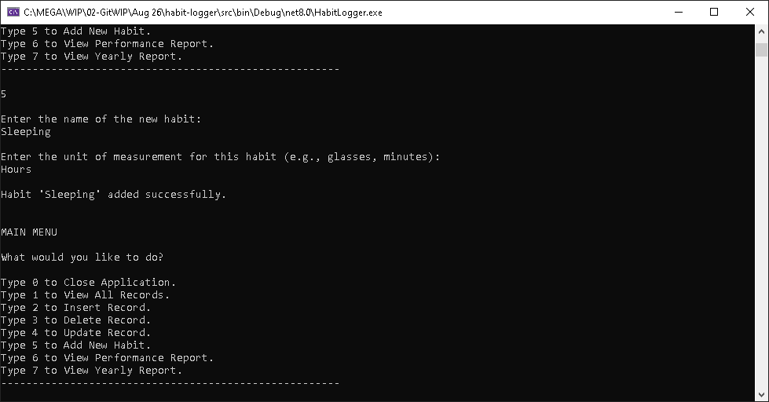

<h1>HabitLogger</h1>

FIX BELOW

Welcome to the HabitLogger App!

This app helps you log your  

This app helps you log and track your habits effectively. You can record various habits, manage your daily progress, and analyze your performance over time.

This is the C# Console Project #3.

## Features

- **Habit Tracking**: Log your daily habits and monitor your progress.
- **Custom Habits**: Create your own habits and choose the unit of measurement that suits each one.
- **Habit Reports**: Generate reports to see how often you've completed a habit or track specific metrics, such as total kilometers logged.

## Getting Started

### Prerequisites

- .NET 8 SDK installed on your system.

### Installation

#### Console

1. Clone the repository:
	- `git clone https://github.com/Jinboi/habit-logger.git`

2. Navigate to the project directory:
	- `cd src\\HabitLogger`

3. Run the application using the .NET CLI:
	- `dotnet run`

### Console Screenshots

This is the initial screen of the app when you start:

You will be prompted to create or log a habit, and then you'll have a menu to choose your next action:

Once you choose your option, you can log your habit or view your habit history:

You can also generate reports to view habit performance over time:

## Choose an option:
- **a**: For Addition
- **s**: For Subtraction
- **m**: For Multiplication
- **d**: For Division
- **p**: For Power
- **r**: For Square Roots
- **e**: For 10x
- **sin**: For Sine
- **cos**: For Cosine
- **tan**: For Tangent

## How It Works

- **Menu Navigation**: Follow the on-screen instructions to log habits, view history, or generate reports.
- **Customizable Habits**: Create habits that are meaningful to you and track them in a way that makes sense.
- **Habit Reports**: Get detailed reports on your habits, including frequency and specific metrics.

## Room for Improvements

- Consider using Spectre.Console for a more polished UI. 
- Additional features like reminders and habit streaks could be added.

## Contributing

- Contributions are welcome! Please fork the repository and create a pull request with your changes. 
- For major changes, please open an issue first to discuss what you would like to change.

## License

- This project is licensed under the MIT License. See the [LICENSE](./LICENSE) file for details.

## Contact

- For any questions or feedback, please open an issue.

---
***Thank you and Happy Coding!***